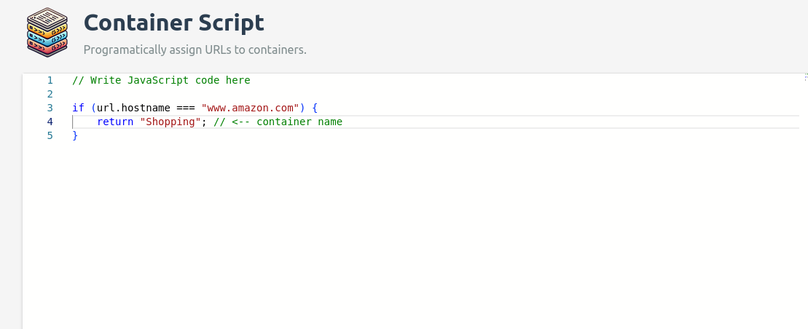

# Container Script

> Firefox Addon for programmatically assigning URLs to containers.

### Install

https://addons.mozilla.org/en-CA/firefox/addon/container-script/

### Screenshot



### Build

``` sh
npm ci
npm run build:monaco
npm run package
```

### Local Development

* Open firefox to `about:debugging#/runtime/this-firefox`
* Click "Load Temporary Add-on..."
* Select the `dist/manifest.json` file.

### Notes

We're forced to vendor the monaco-editor repository until the following PR is merged: https://github.com/microsoft/monaco-editor/pull/4765
